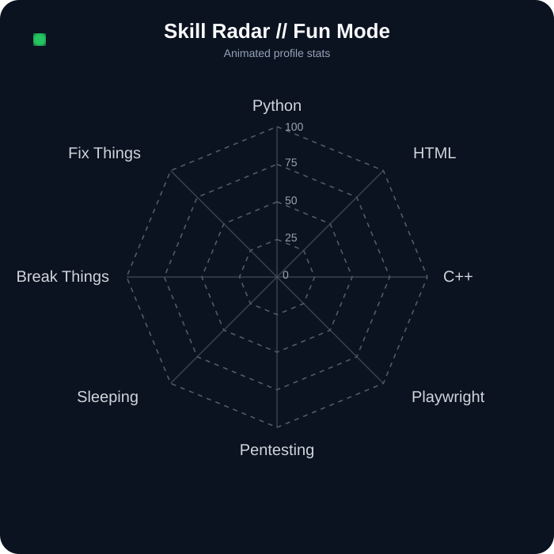

<h1 align="center">Hi 👋, I'm David</h1>

<h3 align="center">
  Business Management • Independent Developer • AI & Automation Explorer
</h3>

<p align="center">
  I build things, break things, learn how they work,
  and explore how far AI can push software development.
</p>

<br>


```yaml
name: David

background:
  Business Administration & Management

role:
  - Independent Developer
  - Hobbyist Builder

programming:
  experience: 3+ years

working_with:
  - Python
  - Playwright
  - HTML
  - C++
  - AWS
  - Cloudflare
  - Git

interests:
  - AI-assisted engineering
  - automation
  - pentesting
  - software architecture
  - cloud infrastructure
  - browser automation
  - AI agents

current_status:
  building: experiments & independent projects
  exploring: what AI + software engineering can become
  mood: probably coding... or sleeping
```

<br clear="both">

---

<h2 align="center">⚡ About Me</h2>

<p align="center">
  I'm a Business Administration & Management graduate who discovered programming
  as a hobby and never really stopped exploring it.
</p>

<p align="center">
  For more than 3 years I've been experimenting with software development,
  browser automation, cloud infrastructure, cybersecurity and AI-assisted engineering.
</p>

<p align="center">
  I enjoy understanding how systems work, testing their limits,
  breaking things on purpose and figuring out how to put them back together.
</p>

<p align="center">
  Programming is something I do independently because I genuinely enjoy
  turning ideas and experiments into working software.
</p>

---

<h2 align="center">🧠 Skill Network</h2>

<p align="center">
  
</p>

<p align="center">
  <sub>
    Skills are a playful representation of what I currently use and explore —
    not scientific measurements.
  </sub>
</p>

---

<h2 align="center">🧰 Technologies & Tools</h2>

<p align="center">


<br>


</p>

---

<h2 align="center">🔬 What I Like Exploring</h2>

<table align="center">
<tr>
<td align="center">🤖<br><b>AI Agents</b></td>
<td align="center">⚙️<br><b>Automation</b></td>
<td align="center">🔐<br><b>Pentesting</b></td>
<td align="center">☁️<br><b>Cloud</b></td>
</tr>

<tr>
<td align="center">🌐<br><b>Browser Automation</b></td>
<td align="center">🧠<br><b>Architecture</b></td>
<td align="center">🧪<br><b>Experiments</b></td>
<td align="center">🛠️<br><b>Building & Breaking</b></td>
</tr>
</table>

<br>

<p align="center">
  One of the things that interests me most is exploring how far modern AI agents
  can go when combined with traditional software engineering.
</p>

---

<h2 align="center">🧪 Developer Stats</h2>

<div align="center">

| Stat | Current Status |
|---|---|
| 🐍 Python | `building things` |
| 🌐 HTML | `making them visible` |
| ⚙️ C++ | `still learning` |
| 🎭 Playwright | `browser goes brrrr` |
| 🔐 Pentesting | `curious mode enabled` |
| 💥 Break Things | `PRO` |
| 🔧 Fix Things | `SEMIPRO` |
| 💤 Sleeping | `LEGENDARY` |

</div>

---

<h2 align="center">📊 GitHub</h2>

<p align="center">
  

  
</p>

<p align="center">
  <sub>
    GitHub language statistics represent repository composition,
    not necessarily overall proficiency.
  </sub>
</p>

---

<h2 align="center">🚧 Current Focus</h2>

```text
AI-assisted development
        │
        ├── AI agents
        ├── automation
        ├── software architecture
        ├── browser automation
        ├── cloud infrastructure
        └── security experimentation
```

<p align="center">
  I like building projects where several of these areas collide.
</p>

---

<h2 align="center">🧠 Current Philosophy</h2>

<p align="center">
  <code>Build → Break → Understand → Fix → Improve → Repeat</code>
</p>

<br>

<p align="center">
  <i>
    Business tells me why something should exist.<br>
    Programming lets me figure out whether I can actually build it.
  </i>
</p>

<br>

<h3 align="center">
  💤 Sometimes the best debugging strategy is sleeping on it.
</h3>
